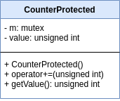

# Informe TP2

## Detalles administrativos

* **Materia:** Taller de Programación I
* **Año y cuatrimestre:** 1°C 2020
* **Alumno:** PARAFATI, Mauro
* **Padrón:** 102749
* [**Link al repositorio**](https://github.com/mauro7x/taller_tp2)

<!-- ##################################################################### -->

# Tabla de contenidos

1. [Presentación del trabajo](#presentacion)
    * [Introducción](#introduccion)
    * [Descripción](#descripcion)
    * [Modelo propuesto por la cátedra](#modelo_catedra)
2. [Especificaciones provistas](#especificaciones)
    * [Recolectores](#recolectores)
    * [Productores](#productores)
    * [Archivos de entrada](#archivos)
        * [Configuración de los trabajadores](#workers)
        * [Mapa](#mapa)
    * [Códigos de retorno](#retorno)
    * [Entrada y salida estándar](#stdio)
    * [Restricciones](#restricciones)
3. [Resolución](#resolucion)
    * [Primera etapa: conceptos necesarios](#uno)
    * [Segunda etapa: abstracciones útiles](#dos)
        * [Objetos activos: Thread](#thread)
        * [Recursos compartidos: Monitor](#monitor)
    * [Tercera etapa: análisis del problema y detección de instancias](#tres)
    * [Cuarta etapa: diseño del modelo](#cuatro)
    * [Quinta etapa: manejo de errores](#cinco)
    * [Sexta etapa: desarrollar el modelo](#seis)
    * [Séptima etapa: testeo y debugging](#siete)
    * [Octava y última etapa: refactorizar](#ocho)
4. [Modelo final](#final)
    * [Procesadores de archivos de entrada](#archivos)
    * [Objetos activos](#activos)
    * [Recursos y recetas](#recursosyrecetas)
    * [Colas bloqueantes de recursos](#colas)
    * [Inventario](#inv)
    * [Contador de puntos de beneficio](#counter)
    * [Excepciones](#exc)
    * [Organizador de la ejecución](#game)
    * [Diagrama final](#diag)
5. [Manejo de errores](#errores)
    * [Códigos de retorno](#retorno)
6. [Conclusiones](#conclusiones)


<!-- ##################################################################### -->

<hr>

# Presentación del trabajo <a name="presentacion"></a>

## Introducción <a name="introduccion"></a>

> Inspirados en la infinidad de juegos de estrategia que jugamos durante una reciente cuarentena, vamos a simular el comportamiento de un pequeño poblado ubicado en cualquiera de los universos pertenecientes a estos juegos.

## Descripción <a name="descripcion"></a>

> Nuestro poblado va a contar con un conjunto de **trabajadores**, que serán:
> - **Recolectores** (de materias primas),
> - **Productores** (que convierten materias primas en puntos de beneficio).
>
> Ambos tipos de trabajadores los vamos a modelar como **threads**. Existirán distintos tipos de recolectores, y tipos de productores.
>
> Cada conjunto de **recolectores** del mismo tipo recibirá los recursos desde una **cola bloqueante**, que deberemos implementar utilizando **condition variables**. Una vez que recibe el recurso, duerme durante **50 ms** (para simular trabajo), y
los deposita en un **inventario de materias primas compartido**.
> *(HINT: para disminuir la complejidad, se recomienda usar una cola bloqueante por cada tipo de recolector (no por tipo de recurso, aunque está permitido), y un solo inventario general).*
>
> Todos los **productores** van a consumir los recursos depositados en el inventario general tan pronto como estén disponibles *(HINT: entender claramente el significado de esto, relacionarlo con condition variables, y describir en el informe la solución)*, luego dormirán durante **60 ms**, y depositarán los puntos en un **contador de puntos general** (que también deberá ser uno solo para todo el escenario).
>
> El **hilo principal** será el encargado de ​ **spawnear** el resto de los hilos, **leer** tanto el archivo de configuración de los **trabajadores** como un segundo archivo con el **contenido del mapa**, y **repartir los recursos** en las colas bloqueantes, que son las entradas de los recolectores. Luego, este hilo se encargará de orquestar la **finalización ordenada del proceso** e imprimirá las **estadísticas finales**.

## Modelo propuesto por la cátedra <a name="modelo_catedra"></a>

> Si bien hay **numerosas maneras de implementar esto**, es **obligatorio** seguir estos **lineamientos** con el propósito de poner en práctica el uso de todas las **herramientas** de **concurrencia** que se ven en clase **(threads, mutex, y condition variables)**.
> 
> También es muy recomendable **incluir explicaciones breves** de cómo implementaron estas partes claves en sus soluciones.

|  | 
|:--:| 
| *Modelo propuesto por la cátedra* |

> ​ En la imagen se puede ver un diagrama indicando los **hilos participantes** y los **recursos compartidos**. Notar que el sentido de las flechas indica una dependencia y no flujo de datos.
>
> El **hilo main** lee los **datos del mapa** y los **reparte** en las *colas bloqueantes*; cada **recolector** pasa las materias primas al
inventario *(la tabla del centro)*; y cada **productor** saca esos recursos del inventario y genera *puntos de beneficio*, que sumará al contador que está más a la derecha.
>
> *(HINT: Notar que para **sincronizar los accesos** al inventario se debe esperar por la condición de que “estén disponibles todos los recursos que necesito”: esto se puede resolver con una condition variable (para simplificar, usar una sola y no una por cada tipo de productor). También hay que contemplar que no todos los productores necesitan las mismas materias primas, por lo que será importante tener en cuenta la diferencia entre **notify** y **notify_all**).*

<hr>

# Especificaciones provistas <a name="especificaciones"></a>

## Recolectores <a name="recolectores"></a>

> Habrá **tres tipos de recolectores**:
> 1. **Agricultores:** son recolectores de *trigo​*.
> 2. **Leñadores:** son recolectores de *madera​*.
> 3. **Mineros:** recolectan *hierro* y *carbón​*. *(HINT: tener en mente que este tipo de trabajador puede recolectar dos tipos distintos de materia prima).*
>
> Tiempo de sleep para simular trabajo: **50ms**.
>
> La cantidad de cada recolector viene definida en un **archivo de configuración** de los trabajadores, que se describe más adelante.

## Productores <a name="productores"></a>

> Habrá **tres tipos de productores**:
> 1. **Cocineros:** convierten *2 unidades de trigo​ más 1 de carbón*, en **5 puntos de beneficio**.
> 2. **Carpinteros:** convierten *3 unidades de madera​ más 1 de hierro* en **2 puntos de beneficio**.
> 3. **Armeros:** convierten *2 unidades de carbón​ más 2 de hierro​* en **3 puntos de beneficio**.
>
> Tiempo de sleep para simular trabajo: **60ms**.
>
> La cantidad de cada productor viene definida en un **archivo de configuración** de los trabajadores, que se describe más adelante.

## Archivos de entrada <a name="archivos"></a>

> Nuestro programa cuenta con **dos archivos de entrada**, uno para la configuración de los trabajadores y otro para el contenido del mapa. El **uso del programa** debería ser el siguiente:
>
> `./tp trabajadores.txt mapa.txt`
>
> Se describe el formato de los dos archivos a continuación.

### Configuración de los trabajadores <a name="workers"></a>

> Consiste en un **archivo de texto** que indica las **cantidades de cada tipo de trabajador**. Se muestra un ejemplo con números arbitrarios a continuación:
> ```
> Agricultores=2
> Leniadores=1
> Mineros=3
> Cocineros=1
> Carpinteros=3
> Armeros=1
> ```

### Mapa de materias primas<a name="mapa"></a>

> Las **materias primas** también serán entrada de nuestro programa, y consistirán en una **matriz de caracteres en mayúsculas**. Dichas mayúsculas son las **iniciales de cada tipo de materia prima**: cada ‘T’ se interpreta como una unidad de Trigo, y los demás casos son análogos. Ejemplo arbitrario:
> ```
> TTTMCHHHC
> TTTMMCCCM
> MMMMMMMMM
> ```

## Códigos de retorno <a name="retorno"></a>

> El programa retornará:
> - **0:** si todo se ejecutó correctamente,
> - **1:** en caso de algún error al abrir, leer, o parsear alguno de los parámetros o archivos.
> 
> En caso de que el alumno encuentre otros tipos de errores, **se permite terminar con cualquier valor de retorno**, y se garantiza que no habrá casos de prueba que los validen.

## Entrada y salida estándar <a name="stdio"></a>

> La **entrada estándar** no será utilizada.
> La **salida estándar de errores** es **libre**, y el alumno puede utilizarla para imprimir mensajes útiles de error, a fin de corroborar alguna teoría al subir la implementación a SERCOM en caso de tener problemas que solamente se reproduzcan en ese entorno.
> La **salida estándar** se utilizará al final de cada ejecución para **mostrar cuántos recursos quedaron** en el inventario, y **cuántos puntos de beneficio** se lograron sumar. El formato será el siguiente:
> ```
> Recursos restantes:\n
>   - Trigo: <unidades-de-trigo-restantes>\n
>   - Madera: <unidades-de-madera-restantes>\n
>   - Carbon: <unidades-de-carbon-restantes>\n
>   - Hierro: <unidades-de-hierro-restantes>\n
> \n
> Puntos de Beneficio acumulados: <cantidad-de-puntos-final>\n
> ```
> Notar que antes de cada guión hay dos espacios.

## Restricciones <a name="restricciones"></a>

> La siguiente es una **lista de restricciones técnicas** exigidas por el cliente:
> 1. El sistema debe desarrollarse en **ISO C++11**.
> 2. Está **prohibido** el uso de variables globales.
> 3. Leer atentamente los lineamientos y recomendaciones.
> 4. El único uso permitido de funciones que sirvan para gastar tiempo (usleep) es para simular trabajo como se especificó. **NO está permitido** usarlas como mecanismo de sincronización.

<hr>

# Resolución <a name="resolucion"></a>

Para la resolución del ejercicio, decidí organizar el mismo en distintas **etapas**, con el objetivo de modularizar el trabajo y obtener código con responsabilidades claras desde un principio, para evitar terminar el trabajo con un código extenso y poco legible y luego tener que pasar mucho tiempo *refactorizando* el mismo.

## Primera etapa: conceptos necesarios <a name="uno"></a>

Mucho antes de empezar a codear, y de hecho antes de siquiera pensar en el ejercicio, me predispuse a **familiarizarme** con los conceptos necesarios para su realización y a investigar sobre los mismos para poder aplicarlos de la forma esperada y correcta.

Como se describe en el enunciado, este trabajo práctico hace énfasis en la programación **multi-hilo** *(multi-threading)*, en la que justamente se dividen las tareas del programa en no uno sino **varios hilos independientes** de ejecución, cada uno con responsabilidades claras, con el fin de *paralelizar* la ejecución y lograr mayor eficiencia.

Para su implementación en C++, utilizamos la librería `<thread>`, y luego distintas extensiones útiles para la **sincronización** de los mismos y para evitar problemas que en breve explicaremos, como por ejemplo los **dead-locks** o las **race-condition**. Estas extensiones son principalmente `<mutex>` y `<condition_variable>`:

- Los ***mutex*** son un mecanismo de protección de acceso a **recursos compartidos** entre hilos. Permiten evitar el problema conocido como **race-condition** *(en el que dos hilos intentan acceder al mismo recurso compartido y el resultado no es el esperado debido a que las operaciones no son atómicas, es decir, no son operaciones formadas por una instrucción assembly, estas se llaman CRITICAL SECTIONS)* mediante una idea muy simple: cuando un hilo quiere acceder a un recurso compartido, **se "toma" el mutex**, evitando que cualquier otro hilo que quiera acceder al recurso en ese momento pueda hacerlo. Cuando el hilo solicitante termina su tarea, **"libera"** el mutex para que un nuevo hilo lo pueda tomar.

- Las ***condition variables*** permiten evitar loops ineficientes de espera. Se utilizan cuando un hilo necesita que se cumpla una determinada condición para accionar, pero la misma no se cumple en un determinado momento. Una solución *naive* sería hacer un loop `while(/*no se cumpla la condición*/)`, pero esto resultaría muy ineficiente puesto que se chequearía la condición constantemente. Las **condition variables** solucionan este problema de la siguiente forma: cuando un hilo chequea si una condición se cumple y el resultado es que aun no, se pone a **"dormir"** al hilo (*wait*) hasta que se lo notifique de que *algo cambió*. En el momento en que otro hilo notifque a la condition variable, se **"despertará"** al hilo dormido, que nuevamente chequeará si ahora se cumple efectivamente la condición.

Estos dos mecanismos son **esenciales** en el desarrollo de la programación **multi-hilo** y se hará uso extensivo de ellos para llegar al resultado buscado.

## Segunda etapa: abstracciones útiles <a name="dos"></a>

Entendidos los conceptos, me predispuse a extraer **abstracciones** útiles de los mismos, aprovechando ejemplos que habíamos visto en clase o en internet. 

### Objetos activos (`Thread`) <a name="thread"></a>

La primer abstracción extraída y que será importante es la de **objetos activos**. Los objetos activos son aquellos que **corren en su propio hilo de ejecución**. Esto se logra haciendo que su clase lanze un `thread`, con un método al que llamaremos `run()` que se ejecutará en el hilo.

Para lograr encapsulamiento y mayor legibilidad, generamos nuestra clase `Thread` que se encarga de lanzar el método `run()` en un hilo, y de proporcionar la interfaz necesaria para la interacción con el hilo (poder hacerle *start* al hilo, así como poder *joinearlo*). Diremos entonces que todas las clases que hereden de `Thread` serán **objetos activos**.

### Recursos compartidos (`Monitor`) <a name="monitor"></a>

Como se explicó anteriormente, cuando se programa con varios hilos de ejecución hay que tener especial cuidado con los **recursos compartidos** ya que estos deben tener un mecanismo de evitar que dos hilos lo quieran modificar simultáneamente.

Una idea muy útil es la de encapsular, en un mismo "paquete", tanto al **recurso a proteger** como al **mecanismo de protección**. Esta idea se llama "Monitor" *(ya que se encarga de monitorear el acceso al recurso)*. En nuestra implementación, vamos a proteger a los distintos recursos utilizando el mecanismo previamente explicado, `<mutex>`. Nuestra abstracción será entonces **RecursoProtegido** y será la clase que tenga al recurso y un mutex para protegerlo. Es **muy importante** que la API pública que se le ofrece al usuario de la clase tenga todos sus métodos **protegidos**. Para esto será clave reconocer las secciones de código que queremos **atomizar**, llamadas **critical sections**. Una vez que reconocemos estas secciones, simplemente generamos un método para cada una de ellas y lo ofrecemos en nuestra API.

Para ejemplificar, supongamos que tenemos un contador y una necesidad de incrementarlo **sólamente** si el contador está en `0`. Una primer idea podría ser tener dos métodos en nuestra interfaz: `isZero()` y `increment(int value)`, para luego hacer:

```
if (isZero()) { increment(...) }
```

Pero esto sería un ERROR, pues **esta operación no sería atómica**, y entre que chequeamos que el valor era cero y que efectivamente lo incrementamos, **otro hilo pudo haber modificado su valor**. Por lo tanto, lo correcto sería ofrecer el siguiente método en nuestra interfaz: `incrementIfZero(int value)` para atomizar la operación.

## Tercer etapa: análisis del problema y detección de instancias <a name="tres"></a>

Una vez que ya tengo las herramientas listas, procedo a encarar el enunciado del ejercicio con el objetivo de, en una primer leída entenderlo, y en una segunda leída poder **identificar** los entes que deberemos diseñar para resolverlo. 

Detallando el razonamiento seguido, vemos que tenemos:

- Un **mapa** y un **archivo de configuración** que parsear,
- **Trabajadores** que se dividen en **recolectores** y **productores**,
- Distintas **colas de recursos**, de donde los recolectores los tomarán para luego transferirlos al inventario,
- Un **inventario** general compartido,
- Un **contador de puntos de beneficio** compartido.

Procedo luego a utilizar las abstracciones que describí en la sección anterior:

- Podemos modelar a los **trabajadores** como **objetos activos**, que corran en su propio hilo de ejecución y realicen su tarea independientemente del resto del programa.
- Para implementar las **colas de recursos**, como en el enunciado se pide que sean bloqueantes, deberemos usar **condition variables** para notificar a los recolectores que los recursos que necesitan ya están listos para ser recolectados.
- Para modelar el **inventario** podemos utilizar una mezcla de conceptos: por un lado, necesitaremos un mecanismo de protección ya que se trata de un recurso compartido. Por otro lado, necesitaremos una forma de avisarle a los productores que esperan por recursos que los mismos están disponibles. Para esto último, utilizaremos **condition variables**.
- Podemos modelar al **contador de puntos de beneficio** con un **monitor**, puesto que se trata de un recurso compartido que proteger.
- Para el parseo del archivo de configuración y del mapa no necesitamos ningún hilo extra o mecanismo de protección, basta con modularizarlo en dos objetos **parsers** que se encarguen de darnos la información que necesitamos de los mismos, y eso se puede hacer en el **hilo principal**.

## Cuarta etapa: diseño del modelo <a name="cuatro"></a>

Ahora que ya sé qué debo diseñar y que objetos debo crear, me propongo armar un **plan de ejecución** en **pseudo-código** para luego ponerme a desarrollar sus distintas componentes. Es vital este paso, ya que establecer los lineamientos antes de empezar a escribir código tiene como beneficio la obtención de código muy **prolijo**, **legible** y sobre todo, **modularizado**.

Propongo entonces el siguiente *plan de ejecución*:

1) Lo primero que el hilo principal debe hacer es **parsear** el archivo de configuración de los trabajadores. Para esto, utilizará una clase `WorkersConfig` que tendrá este fin específico y le proporcionará al hilo principal la información necesaria para el *spawn* inicial.

2) El hilo principal hace *spawn* (hacer aparecer, generar, instanciar) a los distintos hilos necesarios: un hilo por cada trabajador. 

3) Se pone a *correr* a los distintos *threads*, para que comiencen su ejecución.

4) Se utiliza una clase `MapParser` para procesar el mapa y obtener sus recursos, y mientras se los obtiene se los distribuye entre las distintas **colas bloqueantes de recursos**.

5) Cuando ya no hay recursos en el mapa, se **cierran** las colas de recursos para que los recolectores **finalicen su ejecución**, se *joinea* a los mismos.

6) Una vez que los recolectores terminan, se **cierra el inventario**, para indicarle a los productores que **ya no llegarán recursos nuevos**.

7) Cuando los productores terminen de **consumir los recursos del inventario**, terminan su ejecución y se *joinean* sus threads.

8) Se **imprimen los resultados finales** por salida estandar.

## Quinta etapa: manejo de errores <a name="cinco"></a>

Con el modelo listo, lo único que falta decidir es **como manejar los errores** en caso de que la ejecución no logre terminar correctamente. Si bien en el enunciado no lo exige, voy a utilizar el sistema de **excepciones** que provee C++. Me parece muy cómodo de usar, y genera código más legible sin tener tantas verificaciones por todos lados.

En una sección posterior ([Manejo de errores](#errores)) se explicará como se utilizó este sistema de manera más específica.

## Sexta etapa: desarrollar el modelo <a name="seis"></a>

Llegado este punto, es momento de **escribir el código** que le de sentido a nuestro diseño. Esto no debería ser una tarea difícil, ya que hemos decidido exactamente qué haremos y cómo lo haremos, y nos hemos tomado el tiempo de **familiarizarnos con las herramientas** que tenemos a nuestra disposición, y cuándo es conveniente utilizarlas.

En la sección [Modelo final](#final) explicaré con detalle qué clases diseñe finalmente y la responsabilidad de cada una de ellas.

## Séptima etapa: testeo y debugging <a name="siete"></a>

Con el programa terminado, sólo queda **probarlo** y **debuggearlo** ante la aparición de errores, a fin de solucionarlos. Para esto, utilicé las pruebas que se brindan en el sitio de entregas de la materia ([SERCOM](https://sercom.7542.fi.uba.ar/)) ya que justamente son las pruebas que verifican el comportamiento esperado de nuestro trabajo.

Se comprobó que, después de varias etapas de **debugging** y de **corrección de errores**, efectivamente **las pruebas pasaron**. En este punto ya tenemos un programa que cumple con lo pedido, y que por ende soluciona el ejercicio propuesto.

## Octava y última etapa: refactorizar <a name="ocho"></a>

Finalmente, entré en esta etapa de **refactor** en la que se busca mejorar partes del código que no me convencen, a fin de buscar mayor legibilidad, menos acoplamiento y mayor eficiencia. Por la modalidad seguida, **esta etapa fue muy corta**, ya que considero que plantear el modelo desde un principio ayuda mucho a escribir código limpio en menos intentos.

Para terminar, me aseguré de que cada parte del código este **documentada correctamente** y que sea fácilmente legible, así como de que las responsabilidades sean claras. Una vez logrado esto, **dí por finalizado el trabajo** y me predispuse a escribir el informe del mismo.

<hr>

# Modelo final <a name="final"></a>

En esta sección detallaré cada una de las clases que componen mi **modelo final**, dejando en claro la **motivación inicial** para su diseño, su **responsabilidad** y su **rol** en el ejercicio resuelto. A su vez incluiré detalles de implementación para cada una de las clases diseñadas.

## Procesadores de archivos de entrada <a name="archivos"></a>

Para **procesar los archivos de entrada**, diseñé dos clases específicas, una para cada uno de los archivos:

- `WorkersConfig`: clase que se encarga de parsear el archivo de configuración de los trabajadores. Se utiliza para encapsular este parseo, y que el hilo principal simplemente lo instancie y lo utilice preguntándole cuántos agricultores debe generar, cuántos leñadores, etc.
    * **Implementación**: utiliza un `unordered_map` debido a que este está implementado como un HashMap y es *O(1)* para el acceso, por lo que resulta muy eficiente utilizarlo. Se sobrecarga el operador `operator[]` para el acceso a las cantidades, para lograr mayor legibilidad y evitar tener tantos *getters* como tipos de trabajadores hayan en el ejercicio.

|  |
|:--:|
| *Diagrama de clase **WorkersConfig*** |

- `MapParser`: clase que se encarga de parsear el archivo del mapa. El hilo principal sólo debe instanciarlo y utilizar su método pop para ir obteniendo los recursos uno a uno.
    * **Implementación**: se utiliza nuevamente un `unordered_map` para el mappeo desde el caracter leído hacia el `Recurso`. Se sobrecarga el operador `operator>>` para el pop, a razón de dar legibilidad (podemos ejecutar: `map >> resource;`). Un detalle es que se elige procesar los recursos uno a uno a medida que el hilo principal los pida, con el objetivo de que los recursos se inserten en las colas apenas estén disponibles.

|  |
|:--:|
| *Diagrama de clase **MapParser*** |

## Objetos activos <a name="activos"></a>

Para los **objetos activos** *(como se explicó previamente, esto significa que corren en su propio hilo de ejecución)*, diseñe clases que hereden de la clase `Thread`, y estas son: `Gatherer` como abstracción para los recolectores, y`Producer` como abstracción para los productores. Procedo a detallarlas:

- `Thread`: clase abstracta de la que deben heredar los objetos activos a diseñar. Deben sobrecargar el método `run()` que será el que se ejecute cuando se lance el hilo.
    * **Implementación**: tiene como atributo un `std::thread` que se instancia (y lanza) con el método `start()`.

- `Gatherer`: abstracción para los recolectores. Heredan de `Thread`, corren en su propio hilo, y en su ejecución se dedican a intentar extraer recursos de la cola que les fue asignada, y agregarlos al inventario que les fue asignado.
    * **Implementación**: se implementa el polimorfismo utilizando **inyección de dependencias**, para evitar tener que crear muchas clases para cada recolector que al fin y al cabo hacen lo mismo: extraer recursos de una cola y ponerlos en un inventario. Para eso, en la instanciación, **se recibe por referencia la cola de recursos correspondiente**, por lo que el creador deberá ser el que se encargue de pasarle la cola que le corresponda.

- `Producer`: similar a `Gatherer` pero para productores. En su ejecución, intentan obtener los recursos del inventario para construir la receta que les fue asigniada, y si lo consiguen suman los puntos al contador general.
    * **Implementación**: al igual que para `Gatherer`, se utiliza inyección de dependencias para indicarle a cada productor cuál es la **receta** que deben intentar construir.

A continuación incluyo un diagrama que muestra la relación entre estas clases:

|  |
|:--:|
| *Diagrama de clases que muestra la herencia de los **objetos activos*** |

## Recursos y recetas <a name="recursosyrecetas"></a>

La implementación de los **recursos** y de las **recetas** fue algo que me llevó tiempo decidir, puesto que en un principio los veía como objetos, pero luego me di cuenta que no había comportamiento asociado y que para la implementación de este ejercicio me bastaba con definir los recursos utilizando un `enum`, y a las recetas utilizando `unordered_map`s que indiquen la cantidad de cada recurso a utilizar. 

Sin embargo, decidí encapsular esta decisión en los archivos `Resources.h` y `Recipes.h` para que si fuera necesario cambiarlo, no sea necesario cambiar todo el trabajo.

## Colas bloqueantes de recursos <a name="colas"></a>

Para las **colas de recursos** también tuve una diyuntiva en la decisión: en un principio comencé por utilizar **templates**, es decir, armar una plantilla para una **cola genérica**. Esta decisión sólo tenía un aspecto que no me terminaba de cerrar, y es que cuando la cola estaba vacía era necesario lanzar una **excepción** para indicarle al recolector que no sólo no habían recursos, si no que ya nunca los habría. Esto se podía evitar manejando una cola de punteros a objetos, pero preferí evitar esto para no utilizar memoria dinámica.

Frente a esto, decidí quedarme con la implementación **tradicional**: una cola bloqueante **de recursos**, es decir, no hacerla genérica. Lo que me permite esta alternativa es devolver un **valor especial** de **recurso** que indica que ya no hay recursos.

- `ResourceQueue`: implementación de una cola bloqueante de `Resources`. Utiliza `condition_variables` para notificar a los recolectores que hay nuevos recursos o de que se cerró la cola.
    * **Implementación**: contiene una `std::queue`, una `std::condition_variable`, y un `std::mutex` para sincronizar el acceso a las colas, puesto que como se explicó anteriormente, se trata de un **recurso compartido**.
    
|  |
|:--:|
| *Diagrama de clase **ResourceQueue*** |

## Inventario <a name="inv"></a>

Este es quizás el punto de **mayor complejidad** del ejercicio. Mientras pensaba como encararlo, se me ocurrieron dos alternativas, pero finalmente decanté por una de ellas en parte porque en el enunciado lo sugieren y en parte porque genera código mucho más legible. Estas alternativas eran:

1. Diseñar un inventario que tenga una `condition_variable` por cada tipo de productor, por lo que no sería necesario que cada vez que alguien agrega un recurso, se despierten **todos** los productores para chequear si lo que se agregó al inventario les permite completar su receta.
    * **Ventajas**: mayor eficiencia en el manejo de los hilos, no se despiertan hilos porque sí.
    * **Desventajas**: se requiere lógica extra para despertar a los hilos correctos, perdiendo legibilidad y simpleza en la solución.

2. Diseñar un inventario que tenga sólo una `condition_variable`, y que cada vez que llegue un nuevo recurso se notifique a todos los productores y sean ellos los que se fijan si pueden o no construir sus recetas. 
    * **Ventajas**: solución MUY simple, agrega mucha legibilidad y es fácilmente debuggeable, no requiere lógica extra y se implementa en pocas lineas de código.
    * **Desventajas**: es ineficiente si se piensa en extender el código, pues si tuvieramos cientos de productores para miles de recursos posibles, se perdería mucho tiempo verificando condiciones que en realidad no han cambiado.

Considero que para la extensión de este ejercicio es una buena idea quedarse con la segunda alternativa para **ganar simpleza y legibilidad**.

- `InventoryProtected`: **recurso compartido** entre todos los hilos participantes del ejercicio, donde los recolectores almacenan los recursos y de donde los productores retiran recursos para fabricar sus respectivas recetas.
    * **Implementación**: se implementa utilizando un `unordered_map` donde se cuenta la cantidad de cada tipo de recurso que hay en cada momento. Se utiliza una `condition_variable` como se explicó previamente en conjunto con un `mutex` para proteger el acceso.
    
|  |
|:--:|
| *Diagrama de clase **Inventory*** |

## Contador de puntos de beneficio <a name="counter"></a>

El contador de puntos es otro de los **recursos compartidos**, por lo que simplemente implementamos la abstracción descripta anteriormente: creamos un [monitor](#monitor).

- `CounterProtected`: monitor para los puntos de beneficio. Es compartido por los productores.
    * **Implementación**: como todo monitor, cuenta con el recurso a compartir *(en este caso un contador)* y con un `mutex`.
    
|  |
|:--:|
| *Diagrama de clase **CounterProtected*** |

## Excepciones <a name="exc"></a>

Para el manejo de errores, como se describirá en una [sección posterior](#errores), decidí crear la siguiente clase:

- `Exception`: abstracción que permite agregarle un **código de retorno** a una `std::exception`, para poder terminar la ejecución con códigos de error personalizados.
    
|  |
|:--:|
| *Diagrama de clase **Exception*** |

*(Su comportamiento se describe de manera más detallada en la sección marcada).*

## Organizador de la ejecución <a name="game"></a>

Finalmente, es necesario diseñar una clase que se encargue de **organizar** la correcta ejecución del juego, incluyendo las instanciaciones, asignaciones, lógica de inyección de dependencias, etc. En pocas palabras, es el que debe ejecutar al pie de la letra el [**plan de ejecución**](#cuatro) descripto anteriormente, utilizando **RAII** para el almacenamiento de las variables pertinentes y evitando utilizar el **heap**.

Su creación permite, además, encapsular el comportamiento del juego evitando que exista lógica de la aplicación en el `main` y generando código mucho más legible.

- `Game`: organizador, se encarga de realizar las acciones necesarias para llevar a cabo el plan de ejecución descripto anteriormente.
    * **Implementación**: contiene un `WorkerConfig`, un `MapParser`, un `InventoryProtected`, un `CounterProtected`, tres `ResourceQueue`s *(una para cada tipo de recolector)*, tres `Recipe`s *(una para cada tipo de  productor)* y finalmente dos arreglos de `Threads`: uno para los `Producer`s, y otro para los `Gatherer`s.
    
|  |
|:--:|
| *Diagrama de clase **Game*** |

## Diagrama final <a name="diag"></a>

Se llega a partir del diseño de las clases detalladas, al siguiente **diagrama final**:

|  |
|:--:|
| *Diagrama final de clases* |

Donde se minimizan las clases para facilitar la visualización *(los detalles se pueden ver en los diagramas previamente incluidos)* y se utiliza la siguiente convención:
- En **negrita** se marcan las clases que corren en su propio hilo, en este caso `Game` (*main-thread*), los `Gatherer`s y los `Producer`s.
- <u>Subrayadas</u> se marcan las clases que son un **recurso compartido**.

<hr>

# Manejo de errores <a name="errores"></a>

Para mi implementación, decidí vincular los **errores** a distintos **códigos de retorno**, y para esto diseñe una clase `Exception` que hereda de `std::exception` con el objetivo de poder agregarle como atributo el código mencionado a cada excepción. Esta clase me permitirá lanzar mensajes de error y códigos específicos para cada situación que se presente, como podrían ser las siguientes:

- **Errores en alguno de los archivos de entrada:** este caso está contemplado en el enunciado, y nos piden que salgamos con código de error `1`.
- **Errores en el uso del programa:** podemos indicarle al usuario el uso esperado.
- **Errores en la reserva de memoria dinámica:** si `new` falla, podemos devolver un mensaje de error específico y salir con otro código de error que indique este fallo.

Y todos los errores que puedan ir surgiendo a medida que desarrollo las clases, podrán ser agregados a esta lista y devolver un código de error particular.

## Códigos de retorno <a name="retorno"></a>

Adjunto la tabla que indica los **códigos de retorno utilizados**:

| Código | Nombre | Descripción |
|--------|--------|-------------|
| 1 | INPUT_ERROR | *Ocurrió un error con alguno de los archivos de entrada: no existe(n) / no se pudo (pudieron) abrir / no tiene(n) el formato esperado* |
| 2 | USAGE_ERROR | *No se recibieron los parámetros esperados en la ejecución* |
| 3 | ALLOC_ERROR | *Fallo la reserva de memoria dinámica* |
| 4 | UNEXPECTED_NULL | *Se encontró un valor NULL donde no debía haberlo* |


<hr>

# Conclusiones <a name="conclusiones"></a>

Finalizado el trabajo, me pareció que fue muy interesante aprender estos conceptos sobre la programación **multi-hilo**: en lo personal, este fue mi primer acercamiento a este paradigma, por lo que me resultó especialmente nuevo y muy divertido de aprender.